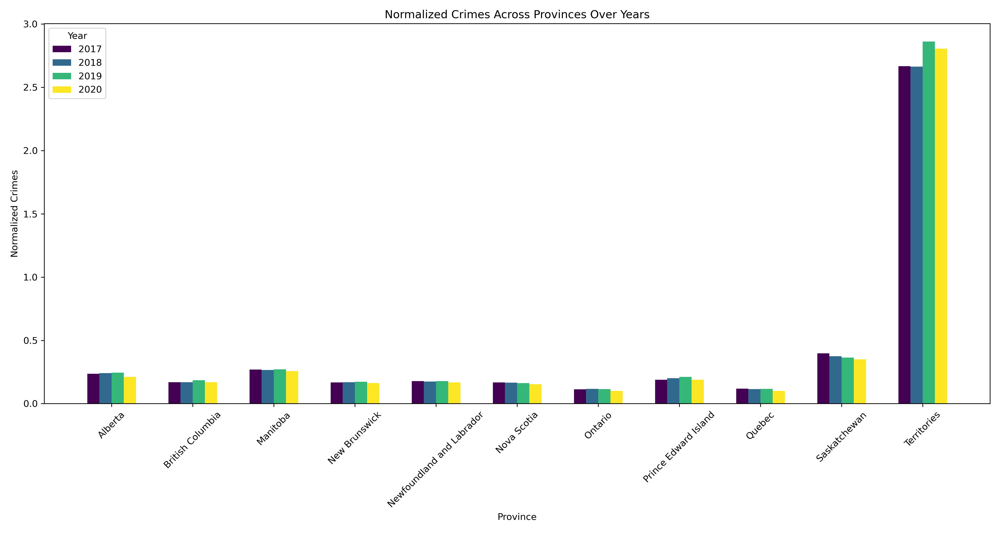

# DATA 695 Capstone Project
### Imad Ahmad and Zakir Ullah

## Introduction

Crime is a complex phenomenon with far-reaching effects on individuals, communities, and society. Crime is defined as the intentional commission of an act that is usually deemed socially harmful or dangerous and specifically defined, prohibited, and punishable under criminal law [1]. Decisions to commit crimes are determined by a complex interplay of factors, including physical abnormalities, psychological disorders, social and economic circumstances, personal choices, and impulse. While some individuals might plan crimes for financial gain or excitement while others act out of anger or fear. Punishment attempts discourage criminal behavior, but its effectiveness varies - factors like police presence and economic conditions influence crime rates. Education plays an essential role; low educational levels have been shown to correlate with criminal behavior, particularly property crimes [2]. It is important to understand the social factors that influence criminal behavior to develop effective strategies for crime prevention. 

 

The use of Machine learning techniques has become a popular approach to crime analysis and prediction. By employing large datasets with complex algorithms, machine learning models are capable of recognizing patterns in crimes that occur regularly while forecasting future crime events [3]. Machine learning methods have revolutionized crime analysis by processing extensive data, spotting patterns, and making predictions. These techniques find application in predictive policing, crime pattern recognition, suspect identification, link analysis, sentiment analysis, fraud detection, resource allocation, crime classification, and early intervention. 

## Motivation

Recent advances in data science, machine learning and data mining have opened new ways to analyze data and derive insights. This project explores the use of machine-learning techniques to investigate the social factors that influence crime and gain valuable insights. This project has increased our knowledge and understanding about machine learning. It also provided us an opportunity to identify and solve problems related to the use of data science in crimes analysis. The project has enabled us to utilize different tools and techniques for performing exploratory data analysis and using machine learning algorithms, which are important for the development of machine learning models. Overall, this project was a valuable opportunity to gain practical experience in machine learning and contribute to creating a more inclusive and accessible society. 

